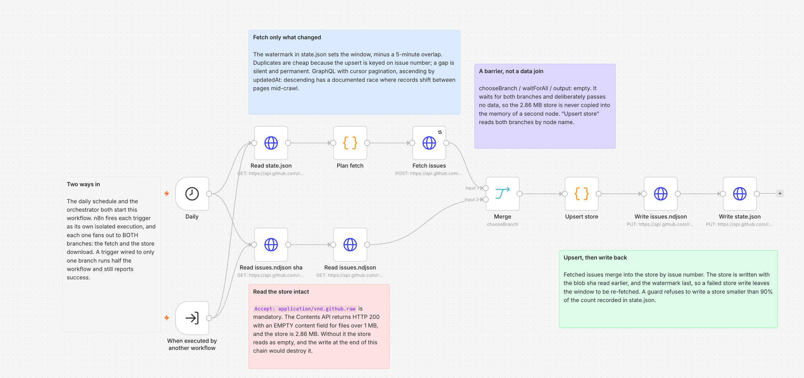
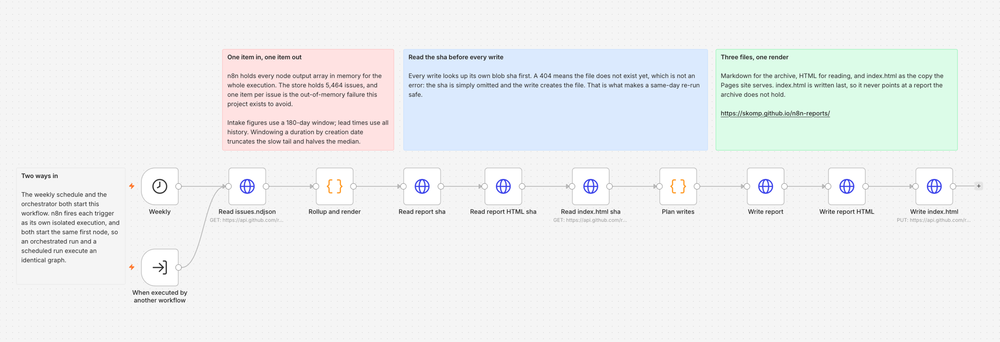
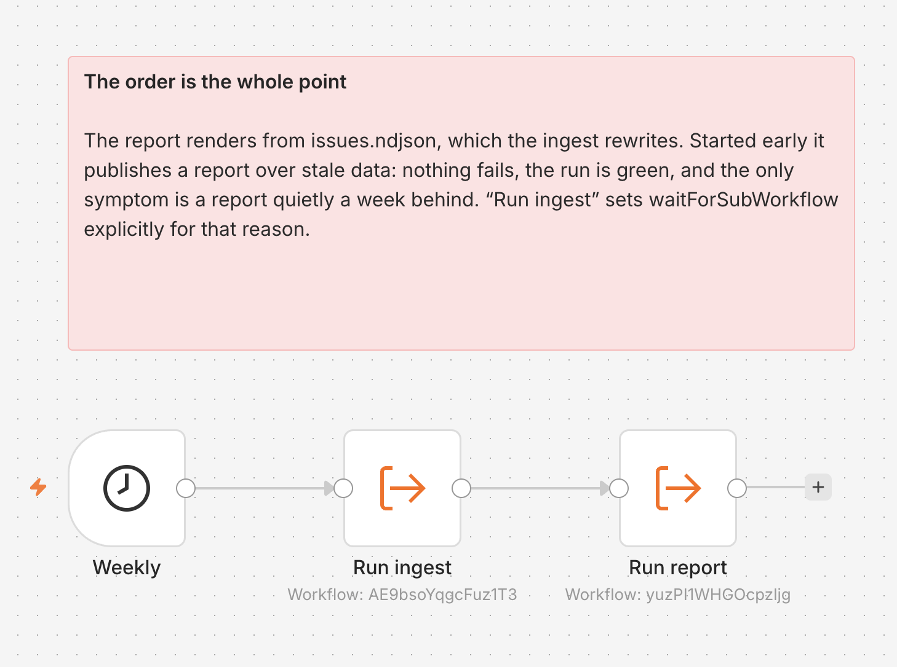

# n8n triage analytics

Measures how `n8n-io/n8n` handles incoming issues: how many are accepted as real
work, how many are bounced at triage and why, which components carry the load,
and how long fixes actually take. Publishes a dated markdown report and a
styled HTML page on a weekly schedule from n8n Cloud. The latest report is live
at <https://skomp.github.io/n8n-reports/>.

**The headline it produces:** of 5,464 triaged issues, **54% are rejected at
triage** — and 2,336 of them (43% of the whole population) were closed as
`incomplete-template`, `support-issue` or `non-english`, meaning they arguably
should never have entered the bug tracker.

---

## How this project came about

This began as the "build your first workflow" exercise that ships with n8n — a
small task for an n8n job application.

The first version was built with **n8n Cloud's built-in AI workflow builder**.
It did the obvious thing: fetch issues and pull requests from GitHub and
aggregate them in a Code node. Against a repository the size of `n8n-io/n8n`
that ran out of memory, and the resulting workspace instability made further
iteration through the built-in builder impractical.

The interesting part was *why*. n8n holds every node's output array in memory
for the whole execution, so what fails is the **item count**, not the payload
size — and no amount of trimming fields fixes that. Everything below is a
consequence of designing around that constraint rather than shrinking the
dataset until it fit.

At that point n8n's **instance-level MCP server** was enabled and Claude Code
connected to it. From there the workflows were developed and deployed through
that connection: authored here as library code with tests, generated into
workflow JSON, and pushed to the instance over MCP. That is also how the
node type versions, the Merge node's semantics, and the Code node's sandbox
restrictions were established — by asking the live instance rather than
guessing.

The recurring work still runs in n8n Cloud. Only the one-off historical
backfill runs locally, because it is the single job whose item count cannot be
bounded. The workflow generator and its tests exist so that the logic
developed here and the logic running inside the n8n Code nodes cannot drift
apart.

**The progression, in short:** first workflow → AI-generated naive version →
real out-of-memory failure → investigate the runtime constraints → move
authoring to Claude Code over n8n's MCP server → redesign around the
constraints → deploy and run the recurring workflows in n8n Cloud.

---

## Quick start

```bash
npm test                                        # 226 tests, zero dependencies
GITHUB_TOKEN=$(gh auth token) npm run backfill  # one-off, ~3.5 min, writes data/issues.ndjson
```

There is nothing to install. Node 24, no `npm install`, no lockfile, no
`node_modules` — the project uses only `node --test`, native `fetch`, and the
standard library. That is a deliberate constraint, not an accident: this code
gets inlined into n8n Code nodes, which cannot import anything.

## Designing around the memory constraint

n8n holds every node's output array in memory for the entire execution. Fetch
40,000 issues and fold them in a Code node, and you are holding 40,000 items at
once. The fix is not a bigger heap — n8n Cloud does not let you set one — it is
never letting the item count grow:

- **The historical backfill does not run in n8n.** It is a local CLI, run once.
  n8n only ever handles the daily delta, roughly 20 records.
- **No Code node ever emits one item per issue.** The report node takes one item
  holding the store as text and returns one item holding the rollup; the ingest
  node takes one item per GraphQL page (at most 100 of them) and returns one.
  This is the most important invariant in the project and the generated code
  says so in a comment.
- **Transport is GraphQL with explicit field selection.** Measured against the
  live API: REST returns ~7,100 bytes per issue, a minimal GraphQL selection
  returns ~498. The whole store is 2.9 MB rather than ~40 MB.

Item *count* is what kills an n8n execution, not bytes. A 2.9 MB string in one
item is fine; 5,464 items are not.

## How it works

| Repo | Holds |
|---|---|
| `skomp/n8n-test` (this) | Library, CLIs, workflow generator, deploy script |
| `skomp/n8n-data` | `issues.ndjson` (5,464 records, 2.9 MB) and `state.json` (sync watermark) |
| `skomp/n8n-reports` | `reports/YYYY-MM-DD-triage.{md,html}` and `index.html` (GitHub Pages) |

```
                    ┌─ local, once ────────────────────────────┐
GitHub GraphQL ────►│ src/backfill.js → data/issues.ndjson     │──► skomp/n8n-data
                    └──────────────────────────────────────────┘
                    ┌─ n8n Cloud, daily ───────────────────────┐
GitHub GraphQL ────►│ HTTP Request (paginated) ─┐              │
                    │                     Merge ├─► Code       │──► skomp/n8n-data
skomp/n8n-data ────►│ HTTP Request (store read) ┘   (upsert)   │
                    └──────────────────────────────────────────┘
                    ┌─ n8n Cloud, weekly ──────────────────────┐
skomp/n8n-data ────►│ HTTP Request → Code (rollup + render)    │──► skomp/n8n-reports
                    └──────────────────────────────────────────┘
                    ┌─ n8n Cloud, weekly ──────────────────────┐
                    │ Execute Workflow (ingest, waits)         │
                    │        ↓                                 │
                    │ Execute Workflow (report)                │
                    └──────────────────────────────────────────┘
```

Each canvas below carries sticky notes explaining **why** it is shaped the way
it is — not what the nodes are called. The facts they record (why the store read
needs a raw media type, why the Merge passes no data, why a 404 on a sha read is
not an error) cost real work to establish and are invisible from the graph.
Someone who "simplifies" any of them breaks the pipeline in a way that stays
green.

### The ingest workflow runs two branches at once



```
Daily ─┬─► Read state.json ────────► Plan fetch ─► Fetch issues ─┬─► Merge
       └─► Read issues.ndjson sha ─► Read issues.ndjson ─────────┘
                                     Merge ─► Upsert store ─► Write issues.ndjson ─► Write state.json
```

The GraphQL fetch and the 2.9 MB store download are independent — the query
needs only the watermark out of `state.json` — so they run concurrently. The
**Merge node (`chooseBranch` / `waitForAll`, typeVersion 3.2) is a
synchronisation barrier, not a data join.** `Fetch issues` emits one item per
GraphQL page and the store branch emits one, so any combine mode would produce
an N x 1 cartesian output; `output: "empty"` emits a single empty item instead,
and `Upsert store` reads all four upstream responses by node name. The tail
stays strictly ordered: the store is written before the watermark, so a failed
store write leaves the next run re-fetching the same window instead of skipping
it.

### The report workflow publishes three files, and a re-run is safe



```
Weekly ─► Read issues.ndjson ─► Rollup and render
       ─► Read report sha ─► Read report HTML sha ─► Read index.html sha
       ─► Plan writes ─► Write report ─► Write report HTML ─► Write index.html
```

| Path | Content | Blob sha |
|---|---|---|
| `reports/YYYY-MM-DD-triage.md` | markdown | sent when the file already exists |
| `reports/YYYY-MM-DD-triage.html` | the same numbers, as a styled page | sent when the file already exists |
| `index.html` | a byte-for-byte copy of the latest HTML | sent when the file already exists |

**All three writes are idempotent upserts.** A second report run on the same day
replaces all three files and leaves them consistent with each other. Re-running
the workflow is safe, and needs no manual delete first.

GitHub's Contents API refuses a PUT over an **existing** file without that
file's current blob sha, and answers 422. It equally refuses a sha for a file
that does not exist yet. So each write is preceded by its own `Read ... sha`
node, and `planWrite()` puts the sha in the PUT body **only when that read
actually returned one**:

- **404** — the file does not exist. Create it, send no sha.
- **2xx with a sha** — the file exists. Overwrite it, send that sha.
- **any other status** — throw, and name the read that failed. A 500 says
  nothing about whether the file exists, and treating it as "absent" would turn
  a transient failure into an opaque 422 on the write.

Every `Read ... sha` node sets `neverError` (so a 404 does not fail the run) and
`fullResponse` (so the status code survives to `Plan writes`). A blob sha is per
file, so each write carries the sha of its own path and never a neighbour's.

The dated paths carry the **date**, not the run. Before
[#2](https://github.com/skomp/n8n-test/issues/2) only `index.html` read its sha
first, so a same-day re-run replaced the published page while both dated files
failed with 422 and kept their first-run content — the Pages site and the
archive then disagreed. The fix overwrites with a conditional sha rather than
deleting and re-creating: one request per file, and no window in which the
report is missing.

`index.html` is still written **last**, deliberately. It is the pointer at the
archive, so if a dated write fails the pointer is not already advanced to a
report the archive does not have.

The HTML is **self-contained** — one inline `<style>` block, no external
stylesheet, script or web font — so it renders identically from GitHub Pages and
from a `file://` URL. Its palette is defined as tokens on bare `:root` with only
the tokens redefined under `prefers-color-scheme: dark`. Every interpolated
value is escaped: component names are GitHub label names, chosen outside this
repo.

`build/build-workflows.js` generates all three workflows by inlining `src/lib/*`
source into their Code nodes, so **the deployed logic cannot drift from the
tested logic**. There is one implementation, not two.

### The canvases document themselves

Each generated workflow carries **sticky notes** (`n8n-nodes-base.stickyNote`,
typeVersion 1): five on the ingest, four on the report, one on the orchestrator.
They are grouped **by phase, never per node** — a note per node would restate
the node name the canvas already draws. What the canvas cannot show is why the
graph has this shape: why two branches, why a Merge that passes no data, why an
extra media type on one read, why the writes are ordered.

A sticky note is a node with no connections, so it changes no behaviour. Tests
assert the count per workflow, that each note still carries the fact its phase
turns on, that the measured figures (2.86 MB, 5,464, 180 days, 90%) survive, and
that **no note covers a functional node or another note** — a note drawn over a
node hides it, and n8n gives no warning.

### The orchestrator runs the two in sequence



```
Weekly ─► Run ingest ─► Run report
          (waits)
```

`Triage analytics — sync and report` syncs the store and then publishes a report
from it, in one execution. It holds no logic of its own — three functional
nodes, two of which are Execute Workflow calls, plus one sticky note.

The ingest and the report are callable because each now carries a **second
trigger**: an Execute Workflow Trigger (typeVersion 1.2, `inputSource:
"passthrough"`) beside its existing Schedule Trigger. n8n allows several
triggers on one workflow and fires each as its own isolated execution, so the
daily and weekly schedules behave exactly as before. The ingest's schedule fans
out to two concurrent branches, and its Execute Workflow Trigger fans out to
**both of them** — wired to one, an orchestrated run would fetch without
downloading the store and still report success.

`Run ingest` sets `options.waitForSubWorkflow: true` **explicitly**, although
`true` is the current n8n default. Sequential execution is the whole point of
this workflow: without the wait, `Run report` starts while the ingest is still
fetching and publishes a report over the **previous** week's store. Nothing
fails, the run is green, and the only symptom is a report that is quietly a week
behind. Leaving that to a default is betting the report's correctness on a
default never changing.

Neither Execute Workflow node sends `workflowInputs`. Both triggers are
`passthrough`, so there is no input schema to fill, and the editor's
`{ mappingMode: "defineBelow", value: null }` is a UI initialisation state that
must never reach committed JSON.

### Activate the orchestrator or the individual schedules, never both

All three workflows carry a Schedule Trigger, and the orchestrator runs in the
**same weekly slot as the report** — Monday 08:00. Publishing a workflow is what
activates its schedule.

> **Publish either the orchestrator, or the ingest and the report. Not both.**
> With all three published the report runs **twice a week**: once from its own
> weekly schedule and once from the orchestrator.

Nothing is published today, so nothing is currently broken. The duplicate run
would not corrupt anything either — every write is an idempotent upsert — but it
doubles the GitHub API cost and publishes a second report for the same date.

| What you want | Publish | Leave unpublished |
|---|---|---|
| A daily sync and a weekly report, independently scheduled | ingest, report | orchestrator |
| One weekly run that syncs and then reports | orchestrator | ingest, report |

### Layout

```
src/lib/labels.js     The 33-label triage taxonomy
src/lib/github.js     GraphQL client, cursor pagination
src/lib/classify.js   segmentOf() and componentOf()
src/lib/metrics.js    Lead times, median, p90
src/lib/store.js      NDJSON parse/serialise/upsert
src/lib/rollup.js     Aggregation
src/lib/report.js     Markdown and HTML rendering
src/backfill.js       One-off historical load (local)
src/sync.js           Incremental sync with watermark
build/                Workflow generator
workflows/            Generated n8n workflow JSON (ingest, report, orchestrator)
scripts/deploy.sh     REST deploy — never executed (needs a paid n8n plan)
scripts/deploy-payload.js  Shapes the REST request body; substitutes sub-workflow ids
```

## Design decisions a reviewer should push on

**Only triaged issues are in scope.** 5,464 of 10,241, those carrying at least
one `triage:*`, `team:*` or `closed:*` label. n8n does not label most
community-filed issues, and there is **no severity label anywhere in the repo's
120** — so grouping the rest would require inference. Restricting to the
labelled population makes every published figure ground truth.

**No LLM classifier.** One was costed at $4.20 for the full backfill on Haiku
4.5 via the Batch API — cheap. It was rejected anyway, because a classifier
gives different answers on different runs, so historical figures would shift
underneath you. Inference presented as measurement is worse than a visible gap.

**Component is only computed for accepted issues.** A bounced issue never gets
a team label because it never becomes work; only 40 of 2,956 rejected issues
have one. Coverage is **65% across all history but 95.3% over the last 180
days** — n8n's labelling discipline has improved sharply, so the windowed
report is far more complete than the lifetime figure suggests. Whatever the
window, the gap is published as `unclassified` rather than hidden.

**Intake windows to six months; lead times never do.** Windowing a lead time by
creation date understates the median by 2× — 25.3 days becomes 12.7 — because
slow issues fall outside a short window and the tail is the whole distribution.
`rollup()` returns `total` (full population) and `window: {since, days,
population}` so every table can print the denominator it actually used.

**Medians and p90, never means.** Fix lead time is 25.3 days at the median and
155.9 at p90. An average would be meaningless.

## What the tests are for

226 tests, and the number is not the point. Partway through, a mutation review
seeded 17 deliberate bugs into a suite of 42 passing tests. **14 of them
survived with the suite fully green** — including deleting the `mergedAt`
filter, the single most load-bearing rule in the codebase.

The final pre-merge review found three more of the same shape in a suite of
187: the dead archive link, a table sort that could be inverted without turning
a single test red, and a merged-PR sort that could be deleted outright. All
three now have a test that has been watched failing.

The tests were written to pass, not to fail. They have since been rebuilt so
that every rule has a test that has been *watched failing* against a broken
implementation, and the suite now catches all of them. If you change something
here, hold that standard: **a test you have only ever seen pass has proven
nothing.**

The orchestrator's tests were built that way too. Twenty-two mutations were
applied to `build/build-workflows.js` and every one turned the suite red:
`waitForSubWorkflow` set to `false`, removed, or the whole `options` object
dropped; the two Execute Workflow nodes swapped on the wire and swapped in the
nodes array; either `workflowId` pointing at the other workflow, or one
character wrong; the ingest's Execute Workflow Trigger wired to one branch head
instead of two; the report's wired to the wrong node; a `workflowInputs` object
emitted; either node version changed; `mode` changed to `each`; `source` changed
to `parameter`; `inputSource` changed off `passthrough`; the trigger replaced by
a NoOp; a Schedule Trigger deleted; the cadence moved to daily; the ordering
note stripped; and `orchestrator.json` dropped from the build.

The sticky notes were held to the same standard. Seven mutations were applied
and every one turned the suite red: a note deleted; a distinctive phrase blunted
into a generality; the `2.86 MB` and `5,464` figures removed; a note moved on
top of a functional node; a note moved on top of another note; a note wired into
the orchestrator chain as a connection target; and a note given an outgoing
connection key of its own.

Fixtures are 10 real records pulled from the live API plus 3 synthetic ones
(numbers `9000xx`) covering branches real data does not exercise. Assertions are
on decoded values — which component, how many days — never on shape.

## Five bugs that only fail in production

None of these is a coding error. Each is an assumption that holds in testing and
breaks in production, and each was caught by checking against something real.
They are documented because the class matters more than the instances.

| What | How it would have failed |
|---|---|
| **GitHub's Contents API silently truncates >1 MB.** Returns HTTP 200, `encoding: "none"`, empty `content`. | Read store → empty → upsert 20 → write back. **Store drops 5,464 → 20 records and the run reports success.** Requires `Accept: application/vnd.github.raw` plus a non-empty guard before any write. |
| **n8n's Code node has no network access.** `fetch`, `axios` and http modules fail at runtime. | The ingest workflow deploys clean, validates clean, dies at 3am on its first scheduled run. Fetching must happen in an HTTP Request node. |
| **`closedByPullRequestsReferences` returns unmerged PRs.** 666 of 1,218 (55%) were closed without merging. | Fix lead time computed against `null`, and component attributed to an abandoned PR. |
| **Two modules each declared `const DAY_MS`.** Fine separately; concatenated into one Code node it is `SyntaxError: Identifier 'DAY_MS' has already been declared`. | Thrown at **run time, not import time**. Every unit test passes, the workflow validates, the JSON is well-formed — and it dies every Monday. Only the packaging can produce this bug, so only the packaging can catch it; there is now a build-time guard against the whole class. |
| **Scoped npm packages need three path segments.** | `packages/@n8n/db` truncated to `packages/@n8n` collapses ~40 packages into one fictitious bucket that would rank second-largest in the report. |

The through-line: a check cheap enough that it cannot fail proves nothing.
Reading a 136-byte `state.json` does not prove you can read a 2.9 MB
`issues.ndjson`.

## Deployment

There are two deploy paths. **One is tested and one is not**, and the
difference matters more than the code they share.

| Path | Status | Evidence |
|---|---|---|
| **Instance MCP server** | **Tested.** Every deployment in this project went through it — all three workflows, created and updated repeatedly, then run. | The runs in "What has actually been run" below. |
| **`scripts/deploy.sh`** (public REST API) | **Never executed. Not once.** It conforms to n8n's published OpenAPI schema and its logic is unit tested, which is a different claim from "known to work". | `tests/deploy.test.js`, plus a local stub of the API. No call has ever reached n8n. |

n8n's **public REST API is unavailable on the free trial**, which is why
`deploy.sh` has never run: creating an API key is gated on a paid plan.

The instance-level **MCP server works instead** — it authorises over OAuth and
is not tier-gated, unlike Git source control (Business/Enterprise only). So
workflows can be authored offline and deployed as code without a paid plan:

```bash
claude mcp add --transport http n8n https://<instance>.app.n8n.cloud/mcp-server/http
```

### What `deploy.sh` was fixed for, and what that fix does not prove

Two defects were found by reading n8n's schema rather than by running anything
([#8](https://github.com/skomp/n8n-test/issues/8)):

1. **The body carried a rejected property.** The generated files hold
   `active: false` at the top level. `active` is `readOnly: true` in the
   schema, and both request schemas set `additionalProperties: false`, so the
   API returns a 400 rather than ignoring it. The script would have failed on
   its first call. The body is now shaped to the four required properties plus
   the optional ones the schema accepts — in `scripts/deploy-payload.js`, not
   in the generator, because `active: false` is worth keeping in a checked-in
   workflow file: it records that nothing runs on a schedule.
2. **Matching by name allocates new ids.** On an instance where these
   workflows do not exist, all three are created with new ids — but the
   orchestrator addresses its sub-workflows by the ids they carry on *this*
   instance. Three workflows would deploy and one would be silently broken,
   failing at run time rather than at deploy time. The two sub-workflows are
   now deployed first and the ids the API returns are substituted into the
   orchestrator before it is sent. The order is written out in the script; it
   must never go back to iterating a glob.

The shaping and the substitution live in JavaScript so they can be unit tested,
because the API cannot test them. `tests/deploy.test.js` also runs the script
end to end against a **local stub** on `127.0.0.1` that answers the way the
documented schema says n8n answers — that covers the deploy order and the id
capture, which no unit test reaches.

**None of this is evidence that the script works.** The stub was written from
the same reading of the schema as the fix, so it cannot disagree with it. The
first real run against a paid instance is still the first run. This repository
has already been bitten once by treating a cheap check as proof of health, and
"conforms to the documented schema" is not "known to work".

Node type versions are read from the live instance rather than assumed —
`scheduleTrigger` 1.4, `httpRequest` 4.5, `code` 2, `merge` 3.2,
`executeWorkflow` 1.3, `executeWorkflowTrigger` 1.2. All three initial guesses
were wrong, two of them silently.

The orchestrator addresses its two sub-workflows **by id**
(`AE9bsoYqgcFuz1T3` and `yuzPI1WHGOcpzljg`), not by name. Those ids are
deployment facts: a wrong id points the orchestrator at a different workflow and
the run still succeeds. `SUB_WORKFLOWS` in `build/build-workflows.js` is the one
place they are written down.

## What has actually been run

Everything below was executed against the live instance and the real
repositories, not asserted from a green test run.

| Workflow | id | Runs | What it proved |
|---|---|---|---|
| Ingest | `AE9bsoYqgcFuz1T3` | 3 | Cursor pagination over **5 pages — 439 issues, 0 duplicates**. Issue numbers advance strictly across pages, so the cursor is genuinely carried. The Merge barrier emits exactly one empty item and the 2.9 MB store is not copied through it. |
| Report | `yuzPI1WHGOcpzljg` | 3 | Three idempotent writes. Two same-day re-runs left `index.html` byte-identical to the dated archive — the defect in [#2](https://github.com/skomp/n8n-test/issues/2). |
| Orchestrator | `n3cSgsUgaLDg23Wg` | 1 | Sequential execution, proven by commit timestamps: the ingest's last write landed at `12:52:47`, the report's first at `12:52:50`. `waitForSubWorkflow` is honoured in practice, not merely set in config. |

Store integrity held throughout: 5,464 records before and after a 439-record
upsert, byte size unchanged, watermark advancing correctly. The truncation
guard ran and passed rather than being bypassed.

**All three are deployed but unpublished** — nothing runs on a schedule yet.
Publishing a workflow is what activates its trigger.

## Limits worth stating plainly

- **This measures intake and triage, not delivery.** 98% of accepted issues
  move into Linear, at which point GitHub stops being the system of record.
  Do not read it as engineering throughput.
- **35% of accepted issues have no component** across all history, though only
  4.7% within the last 180 days. Reported as `unclassified` either way.
- **Fix lead time covers 543 issues**, not 5,464 — only those with a linked PR
  that actually merged.
- **`index.html` always shows the most recent run.** Older reports are reachable
  from the link in its footer, which points at the GitHub tree
  <https://github.com/skomp/n8n-reports/tree/main/reports>, or by their dated
  path under `reports/`. **Correction, 2026-09-06:** that link previously pointed
  at <https://skomp.github.io/n8n-reports/reports/>, which returns 404. GitHub
  Pages generates no directory index and the workflow never writes
  `reports/index.html`, so the published page had no working navigation at all.
- **The backfill sometimes trips GitHub's secondary rate limit** around page 20
  of 55. A five-minute cooldown clears it, and the CLI only writes on full
  completion so retrying is safe.
- **The four dominant rejection reasons are process problems, not engineering
  ones** — a skipped issue template, no support channel, no non-English
  routing. Acting on this report means changing intake, not code.

## Documentation

- `docs/superpowers/specs/` — the design, with every measured figure and the
  reasoning behind each decision
- `docs/superpowers/plans/` — the implementation plan, including a correction
  recording two requirements the plan dropped from its own spec
- `docs/DECISIONS.md` — the decision trail
